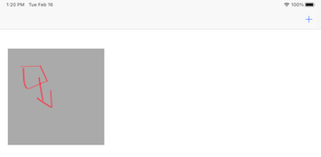

# Doodle Pad for Kids

A doodling iOS / iPadOS app for kids written in Swift and UIKit

:warning::warning::warning:
## :construction: this project is a work in progress

## Screenshots

| iPhone                      | iPad                        |
| --------------------------- | --------------------------- |
|  |  |
|                             |  |

### Learnings

### Useful links

1. Create a drawing app with pencilkit : https://www.raywenderlich.com/6275408-create-a-drawing-app-with-pencilkit
2. Drawing with PencilKit: Getting Started : https://www.raywenderlich.com/12198216-drawing-with-pencilkit-getting-started
3. UIKit Drawing Tutorial: How to Make a Simple Drawing App : https://www.raywenderlich.com/5895-uikit-drawing-tutorial-how-to-make-a-simple-drawing-app

### Version

Swift 5.1, macOS 10.15, Xcode 11
