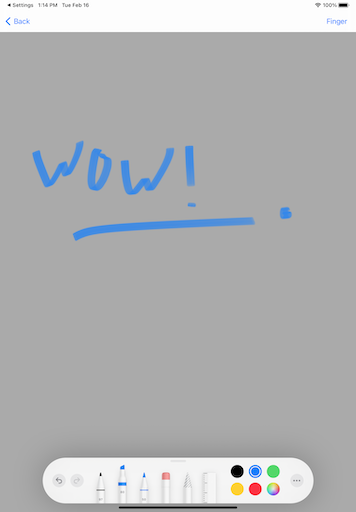

# RayWenderlich - Create a Drawing App With PencilKit

[See how to get started with the recently announced PencilKit in iOS 13 bringing great pencil experiences to your apps.](https://www.raywenderlich.com/6275408-create-a-drawing-app-with-pencilkit)

## Screenshots

| iPhone                      | iPad                        |
| --------------------------- | --------------------------- |
|  |  |
|                             |  |

### Learnings

### Useful links

* https://www.raywenderlich.com/6275408-create-a-drawing-app-with-pencilkit

### Version

Swift 5.1, macOS 10.15, Xcode 11
